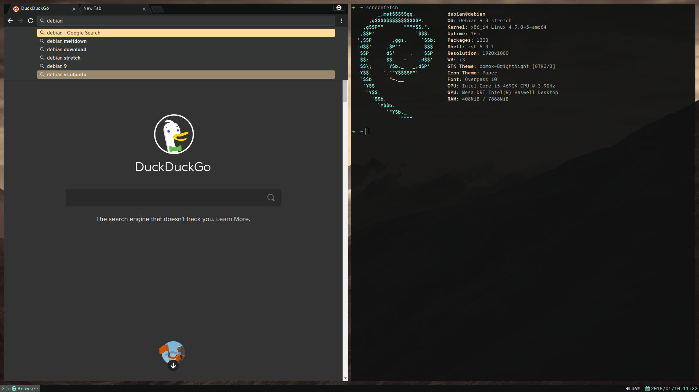
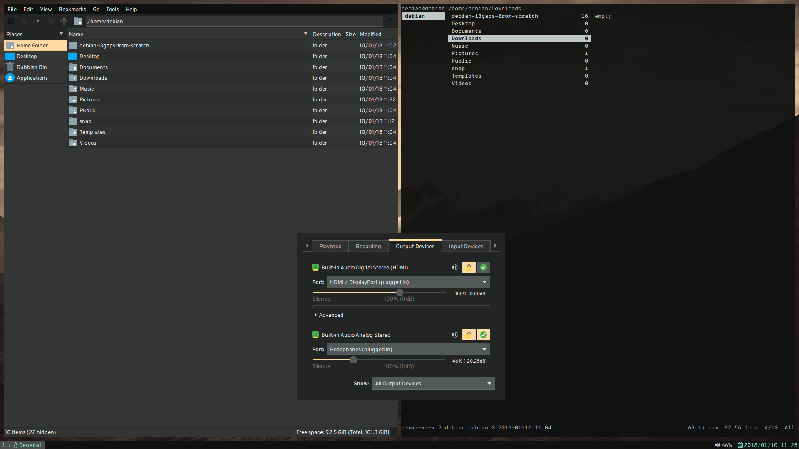

# debian-i3gaps-from-scratch

### Aim of this project is to have a shell script that will transform clean install of Debian Stretch (netinst)
### into a fully working configured system.

#### What it does ? (run.sh):

1. Adds multi-arch support
2. Installs packages from repositories:
`i3 suckless-tools i3blocks xorg software-properties-common devscripts snapd file-roller zsh pcmanfm leafpad pulseaudio pavucontrol alsa-utils gdebi numix-gtk-theme numix-icon-theme screenfetch feh conky build-essential gtk2-engines-murrine gtk2-engines vim ranger caca-utils highlight atool w3m poppler-utils mediainfo compton gparted git python-pip libcanberra-gtk-module curl wget apt-transport-https dirmngr`
3. Copy new sources.list to /etc/apt/, new sources.list uses "deb.debian.org" (Fast Server Select) service, and have included
Contrib and non-free components, needed for compiling stuff later on.
4. Installs zsh shell and sets it up as default shell.
5. Downloads Google Chrome and installs it.
6. Downloads Paper icon theme and installs it.
7. Copy custom GTK2/3 theme and sets it up as default.
8. Sets wallpaper.
9. Downloads newest version of i3-gaps and installs it.
10. Downloads newest version of Termite terminal, installs it and set it up as default for i3-gaps.
11. Copy modified xorg.conf to /etc/X11/ for tear free desktop (Intel).
12. Copy Overpass fonts and Fontawesome.
13. Compile and installs Infinality for OSX looking font rendering.
14. Installs oh-my-zsh theme for zsh shell.
15. Copy configs for i3, leafpad, ranger and termite.

#### What it doesn't ?

1. Network configuration.

#### Installation:

1. Head over to Debian website, download netinst Stretch ISO, create bootable USB, install Debian without any desktop environment (https://www.debian.org/CD/netinst/).

Tip: (If you don't specify root password you will be able to use sudo out of the box, otherwise you will have to install sudo
and add your user to sudo group).

2. Login with your credentials, and run these commands:
```
sudo apt install git
git clone https://github.com/DebianFanboy/debian-i3gaps-from-scratch.git
cd debian-i3gaps-from-scratch
chmod +x run.sh
./run.sh
```
Then follow instructions, and when script finishes, type:
`sudo reboot`

3. To start i3, type in `startx`
4. You will need to set GTK theme manually in Chrome.
5. You may now comment out deb-src lines from your /etc/apt/sources.list

#### Custom keybindings: ($mod = windows key)

1. $mod+Return = Termite.
2. $mod+p = Floating pavucontrol for audio settings.
3. Printscreen key for screenshot (saves in ~/Pictures/ folder).

#### Screenshots:



